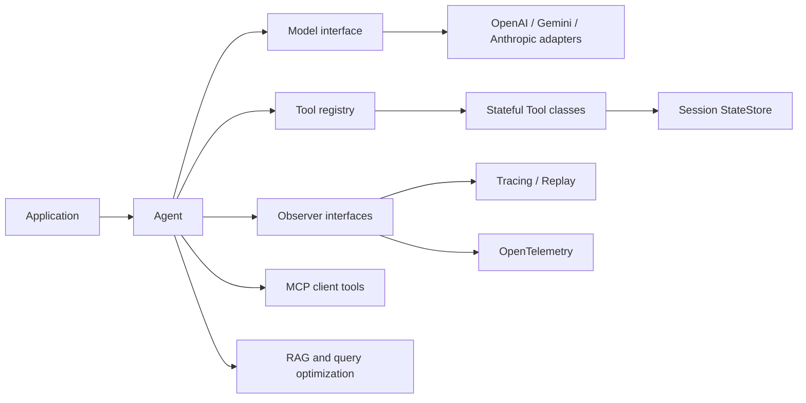

# NeuralPlus

[](https://isocpp.org/)
[](https://github.com/anikulkarni/NeuralPlus/actions/workflows/ci.yml)
[](LICENSE)

**NeuralPlus is a modular C++17 foundation for building model clients, tool-using agents, tracing and replay pipelines, MCP integrations, and RAG systems.**

> **Project status:** early development / pre-alpha. The architecture and core tool loop are available; production model-provider adapters are the first active milestone.

## Why NeuralPlus?

Most GenAI application frameworks are Python-first. NeuralPlus aims to provide a modern C++ alternative for teams that need predictable performance, native integration, explicit ownership, and extensible abstractions without hiding the execution model.

The project is designed around a few principles:

- **Models are objects:** provider clients implement a common `Model` interface and can be wrapped or composed through decorators.
- **Tools are classes:** tools can hold behavior, use session state, and be extended through inheritance.
- **Parallel tool execution:** multiple model-requested tools can run concurrently while preserving result ordering.
- **Pluggable infrastructure:** tracing, replay, metrics, transports, providers, and retrieval components use replaceable interfaces.
- **Readable modern C++:** templates are used where they improve type safety without turning the codebase into template metaprogramming puzzles.
- **Portable builds:** CMake-based C++17 support targeting Linux, macOS, and Windows.

## Current capabilities

The initial core includes:

- Extensible `Model` and `ModelDecorator` abstractions
- Extensible `Tool` and `TypedTool<Input, Output>` abstractions
- Thread-safe, session-scoped `StateStore`
- Tool registry and JSON-schema metadata
- Stateful multi-round model/tool orchestration
- Parallel tool execution using standard C++ futures
- Lifecycle observer hooks for future tracing and metrics adapters
- CMake install/export support
- Cross-platform CI definition
- A dependency-free example and core tests

## Quick start

### Build

```bash
cmake -S . -B build -DNEURALPLUS_BUILD_TESTS=ON
cmake --build build --config Release
ctest --test-dir build --output-on-failure -C Release
```

### Run the example

```bash
./build/neuralplus_stateful_tools
```

On multi-config generators such as Visual Studio, the binary is usually under `build/Release/`.

## Minimal usage

```cpp
#include <neuralplus/neuralplus.hpp>

class MyTool final : public neuralplus::Tool {
public:
    std::string name() const override { return "my_tool"; }
    std::string description() const override { return "Does useful work."; }

    std::string invoke(neuralplus::ToolContext& context,
                       std::string_view arguments_json) override {
        const int calls = context.state->update<int>(
            "my_tool.calls", 0, [](int value) { return value + 1; });
        return "{\"calls\":" + std::to_string(calls) + "}";
    }
};
```

See [`examples/stateful_parallel_tools.cpp`](examples/stateful_parallel_tools.cpp) for a complete model/tool loop.

## Architecture at a glance



The core intentionally does not depend on a specific HTTP or JSON library yet. Provider adapters will own wire-format conversion behind stable model/tool interfaces.

## Roadmap

Development is planned incrementally:

1. **Provider clients:** OpenAI, Gemini, and Anthropic, including tool calling
2. **Tracing and replay:** pluggable file and SQLite implementations
3. **Instrumentation:** OpenTelemetry-compatible traces and metrics
4. **MCP client:** discovery and invocation of MCP tools
5. **Provider expansion:** more model classes, routing, fallback, streaming, and composition
6. **RAG:** retrieval interfaces, hybrid search, reranking, and query optimization

See the detailed [`ROADMAP.md`](docs/ROADMAP.md).

## Supported environments

| Area | Initial target |
|---|---|
| Language | C++17 and newer |
| Build | CMake 3.20+ |
| Linux | Ubuntu and enterprise Linux-compatible distributions |
| macOS | Apple Clang on current supported macOS releases |
| Windows | Visual Studio 2022 / modern MSVC; best-effort until provider CI matures |

## Documentation

- [Getting started](docs/GETTING_STARTED.md)
- [Architecture](docs/ARCHITECTURE.md)
- [Extension guide](docs/EXTENDING.md)
- [Roadmap](docs/ROADMAP.md)
- [Contributing](CONTRIBUTING.md)
- [Security policy](SECURITY.md)

## Scope and maturity

NeuralPlus is not yet a replacement for mature production SDKs. Until the project reaches a stable release:

- APIs may change between minor versions.
- Provider behavior is not available until the corresponding roadmap milestone lands.
- Security-sensitive usage should be independently reviewed.
- The project makes no claim of provider certification or endorsement.

## Contributing

Design discussions, provider adapters, portability fixes, tests, and documentation improvements are welcome. Please read [CONTRIBUTING.md](CONTRIBUTING.md) before opening a pull request.

## License

NeuralPlus is licensed under the [MIT License](LICENSE).
