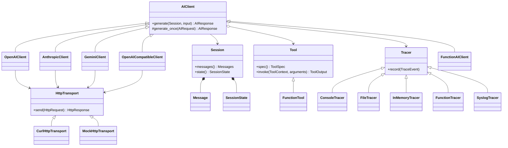

<!--
Copyright 2026 Aniket Kulkarni
SPDX-License-Identifier: Apache-2.0
-->

# Architecture

NeuralPlus keeps one visible path through the runtime:

```text
application -> AIClient -> provider round -> requested tools -> provider round
                    |             |
                 Session      HttpTransport
                    |
              messages + state
```

## Class diagram



## `AIClient`: one orchestration owner

`AIClient::generate` does the shared work:

1. Exclusively lease the supplied session.
2. Append the input message.
3. Take a session snapshot and call `generate_once`.
4. Append the assistant response.
5. If the adapter requests protocol continuation, replay the assistant response
   even when it contains no application tool calls.
6. Otherwise execute requested tools, optionally in parallel.
7. Append tool results in request order.
8. Continue until the model stops or the round limit is reached.

Provider clients implement only `generate_once`. That prevents four subtly
different session, tracing, and tool loops.

Provider output is untrusted, including its requested work. `ClientOptions`
therefore applies three independent limits:

- `max_model_rounds` bounds provider requests in one `generate` call;
- `max_tool_calls_per_generation` rejects an oversized request before any tool
  in that provider response executes; and
- `max_parallel_tool_calls` bounds concurrently executing callbacks.

Parallel calls run in bounded batches. Completion order does not affect the
conversation: results are appended in the order in which the provider
requested them. Setting `parallel_tool_calls` to `false` makes all callbacks
sequential. Calls to the same shared `Tool` object are serialized even when
that object is installed in multiple clients. The final permitted provider
round never invokes newly requested tools because no later round could consume
their results.

There is one class per provider protocol rather than one class per marketed
model. `ModelDescriptor` carries the model ID and capabilities, so adding a
model normally requires no SDK code. `FunctionAIClient` is the in-process
escape hatch for tests and custom models; it serializes calls to its callback.
One client can serve different sessions concurrently. Built-in adapters are
safe for this use, while a custom subclass must make `generate_once`
thread-safe.

Model-specific variation is data-driven:

- stable normalized options such as `temperature` and `max_output_tokens` use
  typed fields;
- less common or newly released request fields use
  `ModelDescriptor::provider_options` and per-call
  `GenerateOptions::provider_options`;
- per-call provider options override model-profile options, while stable typed
  fields override both so the public contract stays predictable;
- synchronous flow-control fields remain SDK-owned: OpenAI and Anthropic
  streaming is disabled, and OpenAI background mode is disabled; and
- opaque `provider_metadata` preserves provider-native reasoning, thinking, and
  tool-continuation data without adding model-name subclasses.

A provider protocol revision belongs in that provider adapter. A genuinely new
wire protocol gets a new `AIClient` subclass. Neither case requires branching
on marketed model IDs or adding overloads per model.

## `Tool`: the executable unit

`Tool` is the small formal interface for work that a model can request.
`FunctionTool` avoids subclass boilerplate. A broader `Task` hierarchy is not
part of the core because application tasks usually compose a client call,
business services, and persistence rather than exposing another runtime
protocol. It can be added by an application without changing the SDK.

Each invocation receives `ToolContext`, including a reference to the session
cache. Tools validate untrusted arguments and return normalized multimodal
`ToolOutput`.

The client calls `Tool::spec()` once during construction, validates it, and
keeps an immutable snapshot for both provider declarations and runtime
argument validation. Mutating data used by a later `spec()` result cannot
change an already constructed client. The `Tool` implementation itself remains
shared and may hold thread-safe application services.

NeuralPlus validates the portable JSON Schema subset it advertises:
`type`, `properties`, `required`, `items`, `enum`, and
`additionalProperties`. Applications can put provider-only declaration fields
in `ToolSpec::provider_options`. Each adapter starts with those fields and then
overwrites the stable function name, description, and input schema so provider
options cannot silently replace the portable contract.

Native server-side tools and local application tools can coexist. Put the
provider's native declarations in the `tools` array of
`ModelDescriptor::provider_options` or `GenerateOptions::provider_options`;
the adapter preserves that array and appends the local `ToolSpec`
declarations. Only local declarations are dispatched to `Tool::invoke`.

## `Session`: history and cache

`Session` owns:

- an optional provider-independent system instruction;
- all normalized user, assistant, and tool messages; and
- `SessionState`, a typed process-local cache based on `std::any`.

The cache uses ordinary C++ function templates for type-safe access; there is
no template-metaprogramming layer. Values are not persisted or traced.

One generation may own a session at a time. A concurrent attempt fails with
`SessionInUseError` instead of interleaving history. Different sessions may run
concurrently. `SessionState::update` holds its lock while calling the updater,
so the updater must not re-enter the same state object.

## Token accounting

Every `TokenUsage` field is optional because providers expose different
counters. The response from `AIClient::generate` is cumulative across all
provider rounds, but a cumulative field remains present only when every round
reported that field. A missing value is never treated as zero; an explicitly
reported zero remains an exact value.

Adapters preserve cache-read, cache-creation, and reasoning/thinking counters
when their protocols report them. `input_tokens` means total input consumed,
including cache reads or writes. Adapters calculate a value such as Anthropic's
total input only when the contributing protocol fields make that calculation
safe.

## Tracing and logging

A client fans each event out to zero or more tracers. Destination failures are
isolated from generation. Tool-related events may originate concurrently, so
custom `Tracer` implementations must be thread-safe. `FunctionTracer`
serializes calls to its application callback.

The default event is metadata-first: correlation IDs, operation name, timing,
status, token counts, and other structured attributes. Content capture is an
explicit opt-in because prompts, responses, tool arguments, and outputs may
contain secrets or personal data.

Built-ins:

- `ConsoleTracer`: human-readable standard error.
- `FileTracer`: JSON Lines, private creation mode on POSIX, optional size cap.
- `InMemoryTracer`: deterministic inspection in tests.
- `FunctionTracer`: application logger or telemetry bridge.
- `SyslogTracer`: [POSIX syslog](https://pubs.opengroup.org/onlinepubs/9699919799/functions/syslog.html);
  unsupported on Windows. It passes the configured facility on every record
  and prefixes the message with its identity without changing process-global
  `openlog` state.

OpenTelemetry is not a mandatory dependency. Adapt events in a
`FunctionTracer` to the official
[OpenTelemetry C++ API](https://opentelemetry.io/docs/languages/cpp/instrumentation/).
Keep provider request IDs as attributes and do not export payloads by default.

## Transport and provider boundary

All built-in providers depend on `HttpTransport`. Production uses the
[libcurl easy interface](https://curl.se/libcurl/c/libcurl-easy.html);
deterministic tests inject `MockHttpTransport`.

Provider implementations own authentication, request mapping, response
mapping, and provider error mapping. They must never copy credentials into
exceptions, traces, fixtures, or response metadata. TLS verification is on and
redirects are off by default.

Known credential header names and headers explicitly marked
`HttpHeader::sensitive` are exact-redacted from response parsing and provider
errors. This avoids both secret disclosure and accidental redaction of ordinary
short metadata values.

`CurlHttpTransport` also bounds provider-controlled response memory. The
defaults accept at most 16 MiB of body data and 256 KiB of aggregate headers;
applications can lower or raise both through `HttpTransportOptions`. A zero
limit, zero timeout, oversized response, malformed request header, or invalid
method/body combination fails explicitly rather than reaching an adapter with
partial data.

NeuralPlus initializes libcurl once for the process lifetime and intentionally
does not call `curl_global_cleanup`. On Unix, eager initialization before
`main` also supports pre-7.84 libcurl during normal program startup. Windows
requires libcurl 7.84 or newer so initialization can occur lazily outside the
DLL loader lock. Repeatedly unloading the NeuralPlus shared library is not
supported. A host that needs `curl_global_init_mem` or a dynamically unloadable
HTTP plugin should inject its own `HttpTransport`. See libcurl's
[global initialization](https://curl.se/libcurl/c/curl_global_init.html) and
[global cleanup](https://curl.se/libcurl/c/curl_global_cleanup.html)
contracts.

## Dependency policy

The mandatory dependencies are:

- C++17 standard library and platform threads;
- libcurl for HTTPS;
- nlohmann/json 3.12.0 for the public `JsonValue`.

CMake prefers installed packages. The nlohmann/json fallback uses a pinned
release URL and SHA-256. Provider SDKs and OpenTelemetry are intentionally not
linked into the core.
